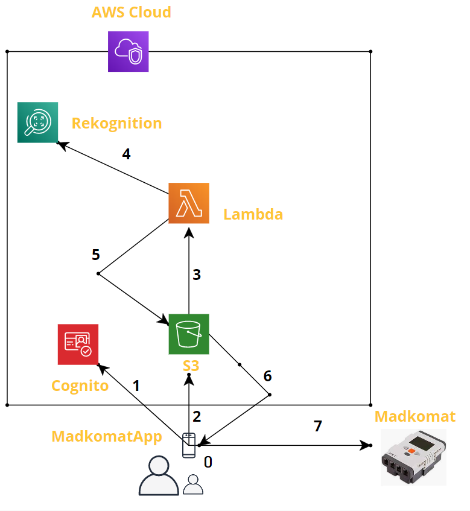

# Madkomat 500+

## Video

## What is this?

I've decided to build a machine that was born in fruitful imagination of an author of the meme Madkomat:

For non Polish speakers: idea here is that mum can take a photo of her smiling baby and gain whatever welfare she wants - here money.

## Architecture

We really have just 3 main components in here:
- MadkomatApp - installed on the Android phone
- Madkomat - a Lego Mindstorm powered ATM like machine
- AWS Cloud - used for image processing

## How does it work?

Have a look at the following diagram:

0. We launch a Java Android app, take a snap and downscale it a bit.
1. Using Android AWS SDK we authenticate in Cognito - we use unauthenticated users for simplification ( you might want to change that ).
2. Having credentials in our hands we send our image to S3 bucket. In the meantime we display some nice animations showing the user that we are looking for faces.
3. Here an event is generated, that triggers our lambda function.
4. Which then invokes AWS Rekognition, telling it to look for faces.
5. We take output of such recognition and store it back in S3 bucket as a json file.
6. In the meantime MadkomatApp is constantly polling S3 waiting for that file to appear and downloads it once it appears. Then app do some more animation showing where faces on the pictures are: green means smiling baby other faces are marked red.
7. If we find a smiling baby we send a message over Bluetooth to Madkomat. There we have a small leJOS app that receives it, opens the hatch, hands over a banknote to the user and closes the hatch.

## Thanks go to
- https://www.facebook.com/pg/tymczasem.rysunki - author of the meme for inspiration!
- Creators of http://www.lejos.org/ library - I love your work!
